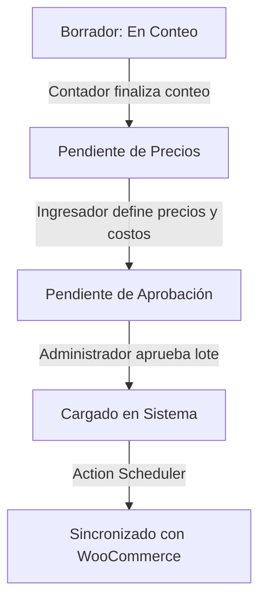

# Manual de Uso - MegaMundo Logística

## A. Introducción y Roles del Sistema

El plugin **MegaMundo Logística** es una solución empresarial de control logístico diseñada para optimizar y auditar la recepción de mercancías por lotes en bodega, sin impactar de inmediato el inventario de venta al público en WooCommerce. 

Para lograr una correcta segregación de funciones y máxima seguridad operativa, el sistema define tres roles con capacidades específicas:

1. **Administrador (`administrator`)**:
   - Acceso absoluto a todas las configuraciones globales, pantallas de lotes, escáner, y logs.
   - Capacidad exclusiva de aprobación final de lotes (transición a `mm_cargado`) y ejecución forzada de la sincronización.
2. **Ingresador (`mm_ingresador`)**:
   - Responsable de definir los costos y precios de venta una vez concluido el conteo físico.
   - Puede ver información financiera (costos, precios, márgenes de ganancia).
   - Autorizado para exportar datos del lote a formato CSV e imprimir tickets de etiquetas térmicas.
3. **Contador (`mm_contador`)**:
   - Operario físico en la bodega o almacén.
   - **Restricción crítica**: No tiene acceso a información financiera (costos ni precios).
   - Únicamente tiene acceso a la pantalla móvil/escáner para contar mercancías físicas e ingresar las cantidades correspondientes a los SKUs.

---

## B. Flujo Lógico de Estados del Lote

Los lotes de ingreso (`lotes_ingreso`) transitan secuencialmente por cuatro estados definidos:

1. **Borrador: En Conteo (`draft`)**:
   - Estado inicial donde el lote se encuentra abierto para recibir lecturas del escáner en bodega.
2. **Pendiente de Precios (`mm_p_precios`)**:
   - El conteo ha finalizado. La tabla financiera se habilita para que el Ingresador complete los campos de Costo y Precio de Venta.
3. **Pendiente de Aprobación (`mm_p_aprobacion`)**:
   - Los precios y costos han sido ingresados y validados. El lote queda congelado a la espera de la revisión de la jefatura o administrador.
4. **Cargado en Sistema (`mm_cargado`)**:
   - Lote aprobado. Se gatilla la cola de procesamiento en segundo plano (Action Scheduler) para inyectar las cantidades y precios finales a WooCommerce.

---

## C. Operación del Escáner en Bodega

La interfaz del escáner está optimizada para dispositivos móviles y pistolas lectoras de código de barras.

1. **Acceso al Escáner**:
   - El Contador inicia sesión en el dispositivo móvil y accede a la URL del escáner asignada para el lote (disponible en la metabox del lote bajo el shortcode `[mm_escaner_bodega]`).
2. **Escaneo de Productos**:
   - Se coloca el foco en el campo "SKU".
   - Al escanear un código de barras con la pistola o cámara, el sistema busca el SKU en la base de datos de WooCommerce.
   - Si existe, añade el producto a la lista con cantidad `1` (o incrementa la cantidad si ya estaba en la lista).
   - Si no existe, muestra una alerta sonora o visual de "Producto no registrado" para que el operario lo separe físicamente.
3. **Cola Offline (Resiliencia de Red)**:
   - Si la red de la bodega falla (pérdida de Wi-Fi), el escáner sigue funcionando localmente.
   - Las lecturas no sincronizadas se guardan en el `localStorage` del navegador.
   - El indicador en pantalla cambiará a **"Modo Offline"**. Una vez que la conexión se restablece, el sistema envía automáticamente los datos acumulados al servidor sin intervención del operario.
4. **Guardar y Finalizar Conteo**:
   - El operario pulsa "Guardar Conteo" para confirmar las lecturas registradas.

---

## D. Paso de Borrador a Pendiente de Precios

Una vez que el Contador de bodega concluye el conteo de la mercancía física:
1. El Administrador o el Ingresador accede al lote dentro del panel administrativo de WordPress.
2. En la metabox de control de estados, cambia el estado de **Borrador: En Conteo** a **Pendiente de Precios**.
3. Se hace clic en **Actualizar**. Esto bloquea el escáner para evitar que se sigan agregando o modificando cantidades por error.

---

## E. Flujo de Precios y Costos

Cuando el lote está en **Pendiente de Precios**:
1. El **Ingresador** ingresa al editor del lote en WordPress.
2. Verá una tabla interactiva con todos los SKUs contados, sus cantidades y tres columnas editables:
   - **Tipo de Movimiento**: Sumar al inventario existente (Ingreso de Proveedor) o Reemplazar inventario existente (Auditoría Física).
   - **Costo Unitario ($)**: Costo de adquisición de la mercadería.
   - **Precio de Venta ($)**: Nuevo precio al público en WooCommerce.
3. **Asistente de Precios por IA (Opcional)**:
   - Si está activa la integración de OpenAI, el Ingresador puede hacer clic en "Sugerir Precios por IA".
   - La IA analizará la descripción del producto, el costo actual y el margen deseado para rellenar de forma inteligente las sugerencias de precios de venta.
4. El Ingresador hace clic en **Guardar Precios y Costos**.

---

## F. Transición a Pendiente de Aprobación

1. Tras validar los precios y costos en la tabla, el Ingresador marca la casilla o cambia el estado a **Pendiente de Aprobación** en la metabox lateral.
2. Se hace clic en **Actualizar** / **Enviar a Aprobación**.
3. A partir de este momento, los campos de costos y precios quedan congelados en modo de solo lectura para el Ingresador, esperando la firma digital del Administrador.

---

## G. Aprobación Final por Jefatura (Administrador)

1. El Administrador recibe la notificación de lote listo para aprobación.
2. Abre el lote en WordPress, revisa el listado de productos, las cantidades físicas validadas, los costos unitarios, y los márgenes proyectados.
3. Si todo es correcto, cambia el estado a **Cargado en Sistema** (`mm_cargado`).
4. Al hacer clic en **Guardar Lote**, el sistema bloquea permanentemente cualquier edición física o financiera sobre este lote y gatilla el proceso automático de sincronización con WooCommerce en segundo plano.

---

## H. Detalle del Procesamiento Asíncrono en Background

Para evitar caídas de servidor por límites de tiempo (timeouts) al procesar lotes con cientos de productos, la sincronización se realiza mediante **Action Scheduler**:
- Al cambiar a `mm_cargado`, se genera una tarea en la cola del Action Scheduler.
- El sistema procesa los productos en **bloques asíncronos de 50 ítems**.
- Cada bloque actualiza el stock físico del producto en WooCommerce (sumando o reemplazando según lo seleccionado) y actualiza su precio de venta y costo (`_regular_price` y `_purchase_price`).
- Una vez finalizada la sincronización de cada producto, se marca con la marca temporal `synced_at` en la base de datos `wp_mm_lote_items`.
- Si el lote se interrumpe, el sistema continuará desde el último producto no sincronizado, garantizando que **no haya duplicación de stock**.

---

## I. Impresión de Tickets Térmicos

El sistema cuenta con una plantilla optimizada para impresoras térmicas de etiquetas (ej. Zebra, Brother, Xprinter):
1. Dentro del lote (estados: `mm_p_precios`, `mm_p_aprobacion` o `mm_cargado`), haga clic en el botón **"Imprimir Etiquetas"** en la parte superior del listado de ítems.
2. Se abrirá una ventana limpia optimizada para impresión (CSS Print).
3. Los códigos de barra de cada SKU se generan localmente en milisegundos gracias a la librería local **JsBarcode**, asegurando el funcionamiento incluso si no hay conexión a internet en el área de etiquetado.
4. Presione `Ctrl+P` (o `Cmd+P` en Mac) para enviar el diseño directamente a la impresora térmica de etiquetas.

---

## J. Exportación a CSV

Para respaldos de contabilidad o control de inventarios externos:
1. El Ingresador o Administrador puede hacer clic en **"Exportar Lote a CSV"** desde la interfaz del lote.
2. El navegador descargará un archivo estructurado con los siguientes datos:
   - ID del Lote
   - SKU
   - Nombre del Producto
   - Cantidad Contada
   - Tipo de Movimiento
   - Costo Unitario
   - Precio de Venta
   - Margen Proyectado (%)
   - Fecha de Conteo
   - Operario que realizó el conteo

---

## K. Solución de Errores Comunes

### 1. Mensaje en el Escáner: "Tu sesión expiró" (Error 401 / 403)
- **Causa**: El operario estuvo inactivo demasiado tiempo o su sesión de WordPress expiró por seguridad.
- **Solución**: El escáner detectará el error y detendrá el envío para evitar la pérdida de datos. **No cierre la pestaña ni borre el SKU actual**. Abra una pestaña nueva, inicie sesión en WordPress con su cuenta y vuelva a la pestaña del escáner para continuar. Los datos pendientes de guardado en la tabla física se mantendrán intactos.

### 2. Producto no se actualiza en WooCommerce después de pasar a "Cargado en Sistema"
- **Causa**: La cola de Action Scheduler aún está procesando el lote o el cron de WordPress está pausado.
- **Solución**: Vaya a **Herramientas > Cola de Acciones** en WordPress para revisar las tareas pendientes. Puede forzar la ejecución manual de las acciones con el hook `mm_logistica_sync_lote_chunk`.

---

## L. Consejos de Seguridad y Buenas Prácticas

- **Nunca comparta credenciales**: El operario de bodega debe utilizar exclusivamente su cuenta con el rol de **Contador**. Esto evita que se alteren precios o se aprueben lotes sin supervisión.
- **Auditoría de Acciones**: Todas las transacciones guardan el ID del usuario creador y editor. La base de datos registra exactamente quién contó cada SKU y cuándo.
- **Uso de Conexiones HTTPS**: Garantice que su sitio WordPress cuente con un certificado SSL activo. La API REST del escáner viaja de forma segura cifrada bajo HTTPS.

---

## M. Configuración del Plugin

Para ajustar el comportamiento del plugin, navegue a **MegaMundo > Ajustes** en la barra lateral de WordPress:
- **API Key de OpenAI**: Clave secreta necesaria si desea habilitar la sugerencia de precios mediante Inteligencia Artificial.
- **Margen por Defecto (%)**: Define el margen mínimo esperado para sugerencias de precios de venta (ej. 30%).
- **Límite de Procesamiento**: Número máximo de ítems procesados por bloque asíncrono (Recomendado: 50).

---

## N. Guía de Uso Diario Paso a Paso

1. **Creación**: El Administrador crea un nuevo Lote de Ingreso en WordPress y lo deja en estado **Borrador**.
2. **Asignación**: Se le entrega el ID del lote al Contador en bodega.
3. **Conteo**: El Contador abre el escáner en su dispositivo móvil y escanea todas las cajas/productos recibidos. Al finalizar, hace clic en **Guardar Conteo**.
4. **Verificación de Conteo**: El Administrador pasa el lote a **Pendiente de Precios**.
5. **Valoración**: El Ingresador abre el lote, introduce los costos y precios de venta (con o sin ayuda de la IA), guarda y pasa el lote a **Pendiente de Aprobación**.
6. **Aprobación**: El Administrador valida los márgenes, aprueba el lote cambiando su estado a **Cargado en Sistema**.
7. **Sincronización**: El sistema actualiza automáticamente el stock y los precios en WooCommerce en segundo plano.
8. **Etiquetado**: El Ingresador imprime las etiquetas con códigos de barras y el equipo en bodega etiqueta los productos físicos.

---

## O. Glosario de Términos

- **SKU (Stock Keeping Unit)**: Identificador único de cada producto en WooCommerce.
- **Lote de Ingreso (CPT)**: Documento de control digital donde se consolidan los conteos de un cargamento.
- **Action Scheduler**: Cola de procesamiento asíncrono robusto nativa de WooCommerce.
- **Nonce (Number used Once)**: Ficha de seguridad única para validar que las peticiones REST provengan de formularios legítimos del sitio.
- **Margen Proyectado**: La diferencia porcentual entre el costo unitario de adquisición y el precio de venta sugerido.
